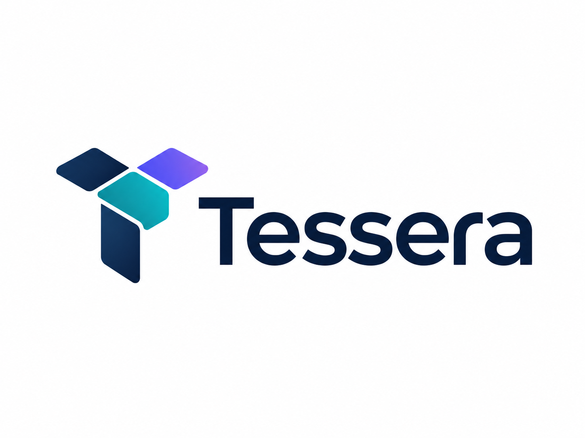

<p align="center">

</p>
<h1 align="center">Tessera.ai</h1>
<p align="center">
<strong>Route intelligence. Verify outcomes.</strong>
</p>
<p align="center">
  Outcome-aware workflow orchestration for IBM Bob, with independent verification,
  persistent outcome memory, and an optional Qiskit optimization extension.
</p>

---

## Overview

Tessera.ai is an outcome-aware developer-workflow control plane.
Its core loop is:

```
Task → Profile → Route → IBM Bob → Verify → Remember → Better Route
```

IBM Bob is the software-engineering runtime. Tessera owns task profiling, workflow selection, policy, independent verification, evidence, and point-in-time outcome memory.

The V1 prototype focuses on one concrete problem: not every engineering task should receive the same workflow depth, and the system that generated a change should not be the only system deciding whether that change is correct.

Tessera therefore separates execution from verification and uses verified historical outcomes to influence later routing decisions.

---

## Core primitive

```
Task
  ↓
Profile
  ↓
Route
  ↓
IBM Bob executes
  ↓
Independent verification
  ↓
Outcome evidence
  ↓
Future routing uses available evidence
```

The key claim is **evidence-informed routing**.
Tessera does not claim self-learning behavior, and the Qiskit extension does not claim quantum advantage.

---

## Proven workflow

The current end-to-end flow has been validated against a controlled billing-service example:

1. A genuinely low-risk billing-formatting task is submitted.
2. Tessera routes it to **FAST** under policy version v1.
3. IBM Bob performs a targeted change.
4. Ordinary project tests pass.
5. Tessera's independent regression evaluation fails on a hidden half-cent boundary.
6. The failed FAST outcome is preserved as immutable evidence.
7. A new comparable low-risk task is submitted.
8. Tessera finds the prior comparable FAST failure in point-in-time history.
9. FAST becomes ineligible and Tessera selects **ASSURANCE** with reason code `PRIOR_FAST_FAILURE`.
10. IBM Bob uses the stronger workflow, including investigation via subagent.
11. The corrected implementation passes ordinary tests and Tessera's independent verification.
12. The successful ASSURANCE outcome is recorded separately; the original FAST failure remains preserved.

This demonstrates the full loop:

```
FAST
→ ordinary tests pass
→ independent verification fails
→ failure remembered
→ comparable task arrives
→ ASSURANCE selected because of PRIOR_FAST_FAILURE
→ correction
→ independent verification passes
```

---

## Product surfaces

### Web control plane

The Next.js application provides a judge- and operator-facing view of Tessera's state:

- Overview dashboard
- Causal proof timeline
- Task creation and routing
- Workflow eligibility and reason codes
- IBM Bob execution records
- Independent verification evidence
- Persisted outcomes
- Light and dark themes
- Optional Quantum Lab

**Routes:**

| Path | Description |
|------|-------------|
| `/` | Overview and causal proof |
| `/tasks` | Create, route, and inspect tasks |
| `/tasks/[id]` | Evidence timeline for a task |
| `/quantum` | Classical vs Qiskit allocation comparison |

### IBM Bob integration

Bob connects to Tessera through the project MCP server and can call:

```
profile_task
select_workflow
begin_execution
complete_execution
evaluate_execution
record_outcome
get_route_history
optimize_batch
```

The project also includes a dedicated **Tessera Engineer** mode, project rules, and reusable skills for routing, evaluation, and quantum optimization.

### Qiskit research extension

Qiskit is an optional heterogeneous-compute experiment for batch workflow allocation.
Tessera expresses a small allocation problem once and compares two solver paths:

```
                 ┌─ Exact classical solver
Optimization ────┤
request          └─ Qiskit QAOA
                        ↓
                 candidate assignment
                        ↓
                 Tessera validates
                 hard constraints
```

The exact classical solver remains the V1 reference because it can prove optimality on the current small problem.

The Qiskit adapter uses:
- `StatevectorSampler`
- `MinimumEigenOptimizer`
- `qiskit_optimization.minimum_eigensolvers.QAOA`
- `COBYLA`

QAOA output is always treated as a candidate until Tessera validates the assignment against the same hard constraints used for the classical solution.

A validated local comparison produced the same feasible assignment and objective from both solvers, while the exact solver remained dramatically faster and could prove optimality. That result is presented as a backend-agnostic architecture demonstration, not as a quantum-performance claim.

---

## Repository layout

```
apps/web/                         Next.js + TypeScript web UI
services/api/                     FastAPI control plane, SQLite, evaluator
crates/router/                    Rust deterministic routing policy
integrations/ibm-bob/             IBM Bob integration
  mcp-server/                     TypeScript MCP bridge
integrations/qiskit/              Isolated Qiskit solver adapter
  tessera_qiskit/                 QAOA implementation
  run_qaoa.py                     stdin/stdout adapter
examples/billing-service/         Controlled target codebase + fixtures
.bob/                             Bob mode, MCP config, rules, and skills
docs/                             Architecture and product documentation
scripts/                          Smoke/demo helpers
```


---

## Start locally

### 1. API

```sh
cd services/api
python -m venv .venv
# activate the virtual environment
pip install -e '.[dev]'
python -m pytest
python -m uvicorn tessera_api.main:app --port 8000
```

The API should be available at: http://127.0.0.1:8000

### 2. Web application

From the repository root:

```sh
npm install
npm run web
```

The web app should be available at: http://localhost:3000

### 3. IBM Bob MCP bridge

From the repository root:

```sh
npm --workspace @tessera/ibm-bob-mcp run build
```

Open the repository root in IBM Bob IDE, select **Tessera Engineer**, and confirm that the workspace MCP server named `tessera` is **Connected**.

The project-level MCP configuration lives at: `.bob/mcp.json`

### 4. Optional Qiskit integration

Create an isolated environment if desired:

```sh
python -m venv .venv-qiskit
# activate it
pip install -r integrations/qiskit/requirements.txt
```

Run the adapter directly:

```sh
python integrations/qiskit/run_qaoa.py < integrations/qiskit/example_request.json
```

On PowerShell:

```powershell
Get-Content integrations\qiskit\example_request.json -Raw |
  python integrations\qiskit\run_qaoa.py
```

Or run the API + web application and open: http://localhost:3000/quantum

---

## Validation

The current build has been validated with:

| Check | Result |
|-------|--------|
| API tests | 8/8 passed |
| Web TypeScript check | passed |
| Next.js production build | passed |
| IBM Bob MCP build | passed |
| IBM Bob MCP typecheck | passed |
| Tessera independent eval | passed |
| Qiskit QAOA adapter | feasible result returned |

The validation model intentionally keeps failure evidence immutable: a failed execution is never rewritten into a success. Corrections create new executions, evaluations, and outcomes.

---

## Design invariants

- IBM Bob executes software-engineering work; Tessera controls routing and verification.
- The agent that generated a change does not self-certify it.
- Failed executions remain immutable evidence.
- Corrections create new execution and outcome records.
- Historical routing uses only evidence available at decision time.
- Hard requirements are eligibility constraints, not soft preferences.
- `PRIOR_FAST_FAILURE` can make FAST ineligible for a comparable later task.
- Qiskit is optional and cannot block core API startup.
- QAOA assignments are candidates until Tessera validates hard constraints.
- No quantum advantage claim is made.

---

## Technology

| Component | Role |
|-----------|------|
| IBM Bob | Engineering runtime, modes, subagents, MCP |
| FastAPI | Tessera API / control plane |
| SQLite | Persisted routing, execution, evaluation, and outcome records |
| Next.js + TypeScript | Web control plane |
| Rust | Deterministic routing-policy implementation |
| Qiskit Optimization | Optional QAOA research extension |

---

## Status

Tessera V1 currently demonstrates a complete outcome-aware routing loop:

```
Route → Execute → Verify → Remember → Re-route
```

The next evolution is to generalize the same control-plane pattern across additional agents, models, tools, and computational backends while keeping verification and policy enforcement independent of the execution layer.

---

## Presentation

[View the Tessera.ai slide deck (PDF)](./Tessera_AI_Slides.pdf)

## Live Demo

[Open the live Tessera.ai app](https://tessera-ai.netlify.app/)
